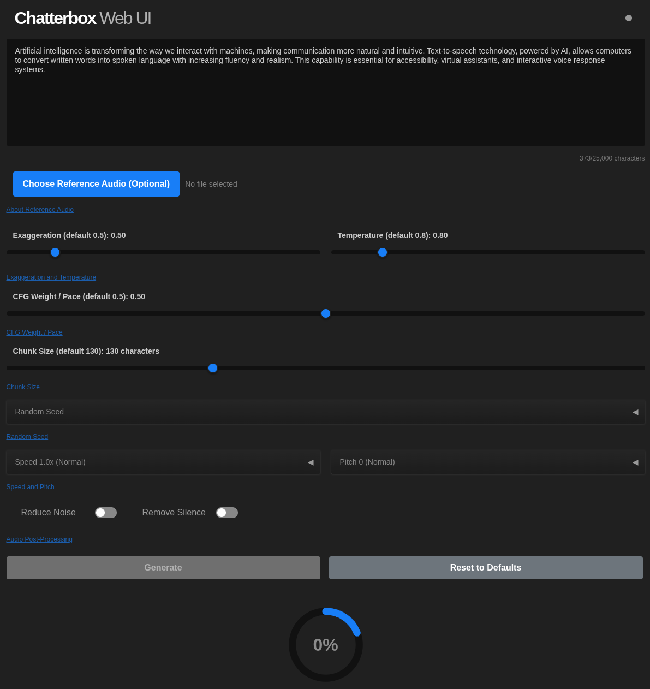

# Chatterbox Web UI

This application is a Python Flask-based web UI designed to facilitate text-to-speech generation using [Resemble AI's Chatterbox TTS](https://github.com/resemble-ai/chatterbox).

## Key Features

- **Zero-shot Voice Cloning**: Upload reference audio to clone any voice
- **Emotion Exaggeration Control**: Unique feature for controlling speech expressiveness
- **Advanced Parameters**: Temperature, CFG weight, and other fine-tuning options
- **Text Chunking**: Automatically splits long text to work within Chatterbox's limits
- **Post-processing**: Speed, pitch, noise reduction, and silence removal
- **Real-time Progress**: Live progress updates during generation
- **Audio Management**: Download, delete, and organize generated audio files
- **Enhanced Security**: Input validation, file type checking, and secure file handling
- **Dark/Light Theme**: Toggle between themes with automatic state persistence
- **Custom Pause Control**: Add custom pauses using `[[1.5]]` syntax for 1.5-second pauses
- **Seed Tracking**: Automatic capture and display of random seeds for reproducible results
- **Watermarked Audio**: All generated audio includes Resemble AI's Perth watermarking



## Sample Audio

### Male
https://github.com/user-attachments/assets/9a4c0ea3-98b5-48f7-a377-2af7bed90b5e

### Female
https://github.com/user-attachments/assets/a264abc0-e6f2-4dc5-b7a0-638c36f0fcee

## Installation

### Prerequisites
- Python 3.10+ (Python 3.12 recommended)
- Git
- 4GB+ RAM (8GB+ recommended for larger models)
- CUDA-compatible GPU (optional, for faster generation)

### Setup Instructions

#### 1. Environment Setup (using Miniconda - Recommended)

[Installing Miniconda - www.anaconda.com/docs/getting-started/miniconda/install](https://www.anaconda.com/docs/getting-started/miniconda/install)

```bash
# Create and activate environment
conda create -n chatterboxwebui python=3.12
conda activate chatterboxwebui
```

#### 2. Install PyTorch

```bash
# For CUDA 12.6 (check your CUDA version first)
pip install torch==2.6.0 torchvision==0.21.0 torchaudio==2.6.0 --index-url https://download.pytorch.org/whl/cu126

# For CPU only (slower but works on any system)
pip install torch==2.6.0 torchvision==0.21.0 torchaudio==2.6.0 --index-url https://download.pytorch.org/whl/cpu

# For macOS with Apple Silicon
pip install torch==2.6.0 torchvision==0.21.0 torchaudio==2.6.0
```

> **Note**: Check [PyTorch installation guide](https://pytorch.org/get-started/locally/) for the correct command for your system.

#### 3. Install Chatterbox TTS

```bash
pip install chatterbox-tts
```

#### 4. Clone and Setup Web UI

```bash
# Clone the repository
git clone https://github.com/bradsec/chatterboxwebui.git
cd chatterboxwebui

# Install requirements
pip install -r requirements.txt
```

#### 5. Fix NLTK Setup (Important!)

```bash
# Download required NLTK data to prevent tokenization warnings
python -c "
import nltk
import os
nltk_data_dir = os.path.expanduser('~/nltk_data')
os.makedirs(nltk_data_dir, exist_ok=True)
try:
    nltk.download('punkt_tab', download_dir=nltk_data_dir)
    print('punkt_tab downloaded successfully')
except:
    try:
        nltk.download('punkt', download_dir=nltk_data_dir)
        print('punkt downloaded successfully')
    except Exception as e:
        print(f'Download failed: {e}')
"
```

### Running the Application

```bash
# Start the web server
python server.py
```

### Access the Web Interface  
Open your browser to `http://127.0.0.1:5000`

> **Network Access**: The server binds to `0.0.0.0` by default, allowing access from other devices on your network at `http://YOUR_IP:5000`

## Usage Guide

### Basic Text-to-Speech
1. Enter your text in the text area (default max: 10,000 characters, configurable)
2. Adjust parameters as needed (defaults work well for most use cases)
3. Click "Generate" to create audio
4. Download or delete generated files from the audio list below

### Voice Cloning
1. Click "Choose Reference Audio" and upload a clear speech sample
2. Supported formats: WAV, MP3, FLAC, OPUS, M4A, OGG (max 50MB)
3. Use 3-10 seconds of clear, single-speaker audio for best results
4. The generated speech will mimic the uploaded voice characteristics

### Advanced Features

#### Custom Pauses
Add custom pauses in your text using double brackets:
```
Hello there. [[2.0]] This pause was 2 seconds long.
Normal pause here. [[0.5]] This was a short pause.
```

#### Keyboard Shortcuts
- `Ctrl/Cmd + Enter`: Start generation
- `Escape`: Focus back to text area

#### Seed Tracking for Reproducible Results
When using "Random Seed", the application captures and displays the actual seed used:
- **Random generations show**: "Seed: Random (used: 847293)"
- **Copy the number** (847293) to reproduce exact results
- **Use Custom Seed** to enter a specific seed for consistent outputs
- **Perfect for**: Experimenting with parameters while keeping voice consistent

### Parameter Guide

**Exaggeration (0.25-2.0)**
- Controls emotional intensity and expressiveness
- `0.5` (default): Neutral, conversational speech
- Higher values (0.7-2.0): More dramatic, expressive speech
- Lower values (0.25-0.4): More subdued, calm speech
- **Note**: Higher exaggeration tends to speed up speech

**Temperature (0.05-5.0)**
- Controls randomness and creativity in speech generation
- `0.8` (default): Good balance of quality and variation
- Lower values (0.1-0.5): More consistent, predictable speech
- Higher values (1.0-2.0): More creative but potentially less stable

**CFG Weight / Pace (0.0-1.0)**
- Controls pacing and adherence to the prompt
- `0.5` (default): Balanced pacing
- Lower values (0.0-0.3): Faster, more relaxed speech (ideal for expressive/dramatic content)
- Higher values (0.6-1.0): Slower, more deliberate speech
- **Tip**: For fast-speaking reference voices, use lower CFG weights (~0.3)

**Chunk Size (50-300)**
- Characters processed per TTS generation call
- `130` (default): Good balance of quality and reliability
- Larger (250-300): More natural flow, fewer processing calls
- Smaller (50-150): More reliable for complex text, may sound fragmented

**Random Seed**
- `Random`: Generates unique variations each time (captures actual seed for reproduction)
- `Specific Number`: Produces identical results with same settings
- **Use Case**: Set a specific seed to compare different parameter combinations

**Speed & Pitch**
- Post-processing effects applied after generation
- Speed: 0.1x to 2.0x playback rate (1.0x = normal)
- Pitch: -12 to +12 semitones (0 = normal)

**Audio Post-Processing**
- **Reduce Noise**: Applies noise reduction to generated audio
- **Remove Silence**: Uses voice activity detection to remove long pauses

### Usage Tips from Chatterbox Documentation

**General Use (TTS and Voice Agents):**
- Default settings (`exaggeration=0.5`, `cfg_weight=0.5`) work well for most prompts
- For fast-speaking reference speakers, lower `cfg_weight` to around `0.3`

**Expressive or Dramatic Speech:**
- Use lower `cfg_weight` values (~0.3) with higher `exaggeration` (0.7+)
- Higher exaggeration speeds up speech; lower CFG weight provides slower, more deliberate pacing

## Configuration

### Environment Variables
```bash
# Server configuration
HOST=0.0.0.0                # Server host (default: 0.0.0.0)
PORT=5000                   # Server port (default: 5000)
DEBUG=False                 # Debug mode (default: True)
SECRET_KEY=your_key         # Flask secret key (auto-generated if not set)
MAX_TEXT_LENGTH=10000       # Maximum text input length in characters (default: 10000)
```

### Text Length Limits
The application has a configurable text input limit to ensure stable performance and reasonable generation times.

**Default Limit**: 10,000 characters

**To change the limit**, set the `MAX_TEXT_LENGTH` environment variable:

```bash
# For longer texts (e.g., articles or chapters)
export MAX_TEXT_LENGTH=25000
python server.py

# For very long documents
export MAX_TEXT_LENGTH=50000
python server.py

# For Windows users
set MAX_TEXT_LENGTH=25000
python server.py
```

**Recommended limits based on use case:**

| **Use Case** | **Suggested Limit** | **Est. Generation Time** | **Memory Requirements** |
|--------------|---------------------|---------------------------|-------------------------|
| **Short clips** | 5,000 chars | 30 seconds - 2 minutes | 4GB+ RAM |
| **Default** | 10,000 chars | 1-5 minutes | 4GB+ RAM |
| **Long articles** | 25,000 chars | 5-15 minutes | 8GB+ RAM |
| **Book chapters** | 50,000 chars | 15-45 minutes | 8GB+ RAM, GPU recommended |
| **Large documents** | 100,000+ chars | 45+ minutes | 16GB+ RAM, GPU recommended |

**Performance considerations for higher limits:**
- Longer texts require more memory and processing time
- GPU acceleration becomes more beneficial for larger texts
- Consider your system's RAM and processing capabilities
- Generation time scales roughly linearly with text length

### Audio Output
- **Format**: WAV files at Chatterbox's native sample rate
- **Quality**: 16-bit PCM audio
- **Watermarking**: All outputs include imperceptible Perth watermarks
- **Processing**: Optional noise reduction and silence removal

### File Limits
- Text input: Configurable (default 10,000 characters)
- Audio uploads: 50MB maximum
- Supported audio formats: WAV, MP3, FLAC, OPUS, M4A, OGG

## File Structure

```
chatterboxwebui/
├── server.py                 # Flask web server and SocketIO handling
├── connector.py              # Chatterbox TTS integration and audio processing
├── requirements.txt          # Python dependencies
├── templates/
│   └── index.html           # Main web interface template
├── static/
│   ├── css/
│   │   └── styles.css       # Styling and responsive design
│   ├── js/
│   │   ├── main.js          # Frontend functionality and SocketIO client
│   │   └── theme.js         # Dark/light theme switching
│   ├── img/
│   │   └── favicon.ico      # Website favicon
│   ├── output/              # Generated audio files (auto-created)
│   ├── uploads/             # Temporary reference audio files (auto-created)
│   └── json/
│       └── data.json        # Generation history and metadata (auto-created)
```

## About Chatterbox TTS

This web UI is built around [Resemble AI's Chatterbox TTS](https://github.com/resemble-ai/chatterbox), a state-of-the-art open-source text-to-speech model with several key advantages:

- **Zero-shot Voice Cloning**: High-quality voice cloning from short audio samples
- **Emotion Exaggeration Control**: First open-source TTS with intensity control
- **State-of-the-art Quality**: Benchmarked against and preferred over leading closed-source systems
- **0.5B Llama Backbone**: Built on proven transformer architecture
- **Ultra-stable Generation**: Alignment-informed inference for consistent results
- **Trained on 0.5M Hours**: Extensive training data for robust performance
- **Built-in Watermarking**: All outputs include Resemble's Perth watermarking for responsible AI

## System Requirements

### Minimum Requirements
- **CPU**: Multi-core processor (Intel i5/AMD Ryzen 5 or better)
- **RAM**: 4GB (8GB+ recommended)
- **Storage**: 2GB free space for models and generated audio
- **Python**: 3.10 or newer

### Recommended Requirements
- **CPU**: Intel i7/AMD Ryzen 7 or better
- **RAM**: 8GB+ 
- **GPU**: NVIDIA GPU with 4GB+ VRAM (for faster generation)
- **Storage**: 5GB+ free space

### GPU Acceleration
- **NVIDIA**: Requires CUDA 11.8+ and compatible PyTorch installation
- **Apple Silicon**: Automatic MPS acceleration on M1/M2/M3 Macs
- **CPU Fallback**: Works on any system, but slower generation times

## Troubleshooting

### Common Issues

**Model Loading Issues:**
```bash
# Ensure sufficient disk space and internet connectivity

# Verify PyTorch installation
python -c "import torch; print(torch.__version__); print(torch.cuda.is_available())"
```

**Audio Generation Errors:**
- Verify text length is within the configured limit (default 10,000 characters)
- Check reference audio format and file size
- Ensure output directory has write permissions
- Try reducing chunk size for complex text

**Text Length Issues:**
- If you need longer texts, increase the limit: `export MAX_TEXT_LENGTH=25000`
- Consider your system's memory when setting higher limits
- Very long texts may require GPU acceleration for reasonable generation times

**Memory Issues:**
- Reduce chunk size to 100-150 characters
- Close other applications to free RAM
- Use CPU mode if GPU memory is insufficient

**Connection Issues:**
- Check firewall settings for port 5000
- Verify no other applications are using port 5000
- Try accessing via `localhost:5000` instead of IP address

### Performance Optimization

**For Better Speed:**
- Use NVIDIA GPU with CUDA
- Increase chunk size to 250-300 for longer texts
- Disable noise reduction and silence removal
- Use lower temperature values (0.5-0.7)

**For Better Quality:**
- Use smaller chunk sizes (100-150) for complex text
- Enable noise reduction for cleaner output
- Use higher quality reference audio (16kHz+, mono, clear speech)
- For expressive speech: Use `exaggeration=0.7+` with `cfg_weight=0.3`
- For fast speakers: Lower `cfg_weight` to ~0.3

**Reproducing Results:**
- Note the actual seed from "Random" generations: "Seed: Random (used: 847293)"
- Copy the seed number (847293) to Custom Seed for exact reproduction
- Keep all other parameters identical for consistent results

**For Better Quality:**
- Use smaller chunk sizes (100-150) for complex text
- Enable noise reduction
- Use higher quality reference audio (16kHz+, mono)
- Experiment with exaggeration values

### Logs and Debugging

```bash
# View detailed logs
python server.py

# Check model loading
python -c "from connector import get_chatterbox_model; get_chatterbox_model()"

# Test audio generation
python -c "from connector import generate_voice; print(generate_voice('Hello world test'))"
```

## License

This project maintains the same MIT license as Chatterbox TTS. See the original [Chatterbox repository](https://github.com/resemble-ai/chatterbox) for details.

## Acknowledgements

- [Resemble AI](https://resemble.ai) for creating Chatterbox TTS
- The open-source community for the various libraries used in this project

## Disclaimer

Don't do bad things with this.