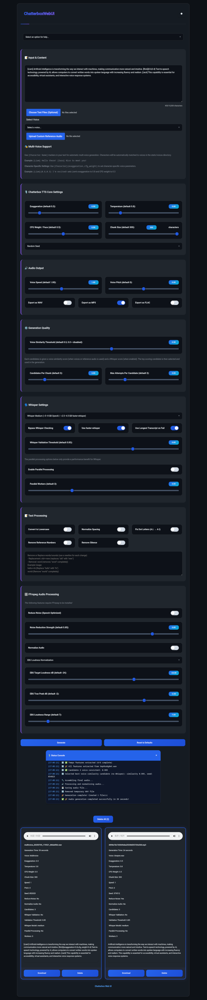

# Chatterbox Web UI

A professional web interface for [Chatterbox TTS](https://github.com/resemble-ai/chatterbox) with extended long text and multiple speaker (characters) voice support. This is a full Python Flask web application, and not a Gradio based web application.

## Examples of Audio Generations

### Sample Default Model Audio

### Sample Custom Voice Audio

### Sample Multiple Voice Audio

## ✨ Key Features

### 🎙️ Voice Generation
- **Zero-Shot Voice Cloning**: Generate speech using any voice sample (10+ seconds recommended)
- **Multi-Voice Support**: Create audiobooks with multiple character voices using `[Character Name]` markers
- **Character-Specific Parameters**: Set individual exaggeration and CFG weight per character with `[Character]{0.8,0.3}` syntax
- **Voice Library Management**: Auto-detect voices from `static/voices/` directory with simple dropdown selection
- **Voice Profiles**: Create and manage reusable voice profiles with custom settings

### 🎛️ Advanced Generation Controls
- **Multiple Candidates**: Generate 1-10 audio candidates per chunk for quality selection
- **Whisper Validation**: Automatic transcription validation with configurable similarity thresholds
- **Voice Similarity Validation**: Audio analysis to ensure voice consistency across generations
- **Intelligent Chunking**: Audiobook-style processing with voice consistency optimization
- **Parallel Processing**: Multi-threaded generation for improved performance

### 🔧 Audio Processing & Quality
- **Noise Reduction**: Multiple algorithms (spectral gating, afftdn) with adjustable strength
- **Audio Normalization**: EBU R128 and peak normalization with customizable levels
- **Format Support**: Export to WAV, MP3, FLAC
- **Post-Processing**: Speed/pitch adjustment, silence removal, and artifact detection

### 📝 Text Processing
- **Smart Text Cleanup**: Automatic spacing normalization, acronym handling, reference removal
- **Sound Word Replacements**: Custom word-to-sound mappings for better pronunciation
- **Long Text Optimization**: Intelligent sentence boundary detection and chunk processing
- **Real-time Progress**: WebSocket-based status updates with detailed generation statistics

### 💾 Data Management
- **Generation History**: Complete metadata tracking for all generated audio
- **Batch Processing**: Upload and process multiple text files simultaneously
- **Auto-cleanup**: Configurable temporary file management
- **Export Options**: Multiple audio formats with quality settings



## 🚀 Quick Start

### 1. Clone and Setup
```bash
git clone <repository-url>
cd chatterboxwebui
python -m venv venv
source venv/bin/activate  # On Windows: venv\Scripts\activate
```

### 2. Install Dependencies
```bash
# Install PyTorch with CUDA support (recommended)
pip install torch torchvision torchaudio --index-url https://download.pytorch.org/whl/cu118

# Install core TTS dependencies
pip install chatterbox-tts
pip install -r requirements.txt

# Optional: Install Whisper for voice validation
pip install openai-whisper faster-whisper

# Optional: Install FFmpeg for advanced audio processing
pip install ffmpeg-python
```

### 3. System Requirements
```bash
# Install FFmpeg (required for audio processing)
# Ubuntu/Debian: sudo apt install ffmpeg
# macOS: brew install ffmpeg
# Windows: Download from https://ffmpeg.org/

# Download NLTK data
python -c "import nltk; nltk.download('punkt_tab')"
```

### 4. Run the Application
```bash
# Development mode
python server.py

# Production mode (requires gunicorn)
gunicorn -c production.py server:app
```

Open your browser to `http://127.0.0.1:5000`

## 📖 Usage

### Basic Text-to-Speech Workflow
1. **Enter Text**: Type or paste text into the main input area, or upload a text file
2. **Select Voice**: Choose from the voice dropdown (auto-loads from `static/voices/` directory) or upload custom reference audio
3. **Core Settings**: Adjust Exaggeration, Temperature, CFG Weight, Chunk Size, and Seed
4. **Audio Output**: Configure Speed, Pitch, and Export Format (WAV, MP3, FLAC, OGG)
5. **Generation Quality**: Set Voice Similarity Threshold, Candidates per chunk, and Max Attempts
6. **Whisper Settings**: Choose model size, enable validation, configure parallel processing
7. **Text Processing**: Enable text cleanup options (lowercase, spacing, dot letters, etc.)
8. **Audio Processing**: Optional noise reduction and normalization
9. **Generate**: Click "Generate" and monitor progress in the status console

### Multi-Voice Audiobooks
1. **Add Character Markers** in your text:
   ```
   [Narrator] Once upon a time, in a land far away...
   [Princess] Help me, brave knight!
   [Dragon] ROAAAAAR! You shall not pass!
   ```

2. **Character-Specific Settings** (optional):
   ```
   [Liam]{0.8,0.3} I'm so excited about this!
   [Sara]{0.5,0.7} That sounds very interesting.
   ```

3. **Auto-Voice Matching**: Characters are automatically matched to voice files in `static/voices/` directory
4. **Generate**: The system processes each character with their assigned voice and settings

### Voice Library Management
- **Auto-Detection**: Place voice files in `static/voices/` for automatic dropdown population
- **Voice Profiles**: Create reusable profiles with custom TTS parameters and reference audio
- **File Support**: Supports WAV, MP3, FLAC, OGG, M4A, and AAC voice files
- **Batch Processing**: Upload multiple text files for sequential processing

### Quality Control Features
- **Multiple Candidates**: Generate several options per text chunk and select the best
- **Whisper Validation**: Automatic transcription checking for accuracy
- **Voice Similarity**: Audio analysis to ensure voice consistency across generations
- **Real-time Monitoring**: Status console shows detailed progress and generation statistics

### Generated Audio Management
- **Complete Metadata**: Each generated file includes all settings used (voice, parameters, processing options)
- **Playback Controls**: Built-in audio player with progress tracking
- **Download Options**: Individual file downloads with original settings preserved
- **History Tracking**: Full generation history with searchable metadata
- **Batch Operations**: Delete multiple files or clear entire history

## ⚙️ Configuration

### Environment Variables
```bash
export HOST=127.0.0.1          # Server host
export PORT=5000               # Server port  
export DEBUG=False             # Production mode
export MAX_TEXT_LENGTH=25000   # Max text length
```

### Audio Settings
- **Exaggeration**: Voice expressiveness (0.25-2.0, default 0.5)
- **Temperature**: Voice variation (0.05-5.0, default 0.8)
- **CFG Weight**: Generation control (0.0-1.0, default 0.5)
- **Chunk Size**: Text processing chunks (50-300, default 300)
- **Speed**: Voice speed multiplier (0.1-2.0, default 1.0)
- **Pitch**: Voice pitch adjustment (-12 to +12 semitones, default 0)

### Generation Quality
- **Candidates**: Number of alternatives per chunk (1-10, default 3)
- **Voice Similarity Threshold**: Voice consistency validation (0.0-0.9, default 0.5)
- **Whisper Validation**: Transcription accuracy checking (default enabled)
- **Max Attempts**: Retry attempts per candidate (1-10, default 3)

### Post-Processing
- **Noise Reduction**: Spectral gating or afftdn algorithms
- **Audio Normalization**: EBU R128 or peak normalization
- **Export Formats**: WAV, MP3, FLAC, OGG with quality settings
- **Silence Removal**: Automatic silence trimming

## 🛠️ Troubleshooting

### Setup Issues
**"NLTK data not found"**
```bash
python -c "import nltk; nltk.download('punkt_tab')"
```

**"FFmpeg not found"**
- Ubuntu/Debian: `sudo apt install ffmpeg`
- macOS: `brew install ffmpeg`  
- Windows: Download from https://ffmpeg.org/

### Performance Optimization
**Memory/Performance Issues**
- Install CUDA-enabled PyTorch for GPU acceleration
- Reduce chunk size (50-150) for low-memory systems
- Decrease parallel workers (1-2) on limited systems
- Use faster-whisper instead of OpenAI Whisper
- Disable Whisper validation for faster generation
- Reduce number of candidates (1-2) for speed

### Voice and Audio Issues
**Multi-voice Problems**
- Ensure `[Character Name]` format is exact (case-sensitive)
- Check character names are consistent throughout text
- Place voice files in `static/voices/` directory for auto-detection
- Use character-specific parameters: `[Character]{exaggeration,cfg_weight}`
- Verify voice files are in supported formats (WAV, MP3, FLAC, OGG, M4A, AAC)

**Audio Quality Issues**
- Increase number of candidates (5-10) for better quality selection
- Enable Whisper validation for transcription accuracy
- Adjust voice similarity threshold (0.7-0.8) for strict consistency
- Use longer reference audio samples (10+ seconds recommended)
- Lower temperature (0.3-0.6) for more consistent voice
- Increase CFG weight (0.6-0.8) for better prompt adherence

**Generation Failures**
- Check status console for detailed error messages
- Reduce text length or increase chunk size
- Try different Whisper model sizes (tiny/base for speed, large for accuracy)
- Disable parallel processing if experiencing crashes
- Clear browser cache and refresh if UI becomes unresponsive

## 📋 System Requirements

**Minimum**: Python 3.10+, 8GB RAM, FFmpeg installed  
**Recommended**: Python 3.12, 16GB+ RAM, CUDA GPU (4GB+ VRAM)

## 🔐 Security & Ethics

- All processing done locally (no cloud dependencies)
- Temporary files automatically cleaned up
- **Important**: Use responsibly and with proper consent for voice cloning

## 📜 License

MIT License - See LICENSE file for details.

## 🙏 Credits

- [Resemble AI](https://resemble.ai) for Chatterbox TTS
- [petermg/Chatterbox-TTS-Extended](https://github.com/petermg/Chatterbox-TTS-Extended) for Whisper integration and other improvements
- [OpenAI](https://openai.com) for Whisper
- [FFmpeg](https://ffmpeg.org) for audio processing
- Community contributors for feature requests and testing